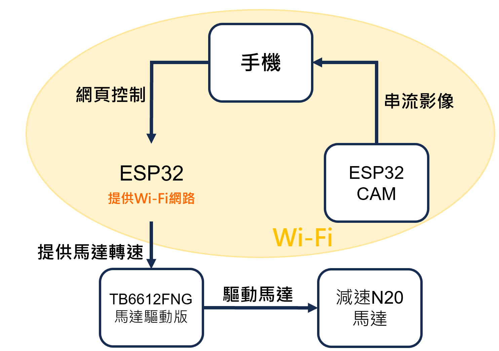

# CCar 專案教學文件

本教材以「影像全向移動小車」為主題，使用 **ESP32（主控）** + **ESP32-CAM（影像）** + **L298N（馬達驅動）** 完成：

- 手機/電腦連上 ESP32 的 AP 熱點後，用網頁控制小車移動與鏡頭角度
- 由 ESP32-CAM 提供 MJPEG 串流，網頁即時顯示影像

專案對應程式資料夾：

```text
esp32/           # 主控：AP、HTTP、WebSocket、全向輪控制、伺服機

  esp32.ino
  omni.cpp
  omni.h
  web.h
  web_guide.md
esp32cam/        # 相機：連 AP、提供 MJPEG /stream

  esp32cam.ino
```

---


## 目錄

- Part 1｜硬體與全向移動（ESP32 / ESP32-CAM / L298N / Omni）
  - 課程總覽：系統方塊圖與資料流
  - ESP32 基本介紹（主控板）
  - ESP32-CAM 基本介紹（相機板）
  - L298N 基本介紹（直流馬達驅動）
  - 三輪 Omni 全向移動原理（逆運動學）
  - 專案程式導讀（Part 1 對應檔案）
  - 課堂實作：接線檢查與「單輪測試 → 三輪合體」

- Part 2｜通訊與串流（WebSocket / MJPEG）
  - 為什麼需要 WebSocket：即時控制的需求
  - WebSocket 基礎：連線、事件、封包（以本專案為例）
  - MJPEG 串流基礎：multipart、frame 與瀏覽器顯示
  - 前端頁面如何控制：`web.h` 的按鍵、重送、停車邏輯
  - 相機端如何串流：`esp32cam.ino` 的 `/stream`
  - 課堂實作：抓封包/看 Console、修改解析度與畫質觀察卡頓

- 附錄 A：常見問題（接線、供電、IP、方向、延遲）
- 附錄 B：名詞表（AP、HTTP、WebSocket、MJPEG、PWM…）


---

## Part 1｜硬體與全向移動（ESP32 / ESP32-CAM / L298N / Omni）

## 1. 課程總覽：系統方塊圖與資料流


系統角色：

- **ESP32（主控）**：建立 AP（熱點），提供 HTTP 控制頁，開 WebSocket 接收指令，算全向輪速度並輸出 PWM，控制伺服機
- **ESP32-CAM（相機）**：連到 AP，提供 `GET /stream`（MJPEG 串流）



本專案預設網路參數（請對照程式）：

- 主控 AP：`192.168.4.1`（見 `esp32/esp32.ino` 的 `local_ip`）
- 相機固定 IP：`192.168.4.20`（見 `esp32cam/esp32cam.ino` 的 `local_IP`）
- WebSocket 埠：`81`（見 `esp32/esp32.ino`：`WebSocketsServer ws(81);`）


---

## 2. ESP32 基本介紹（主控板）

### 特色

- 內建 Wi-Fi（可連網）
- 很多型號也內建 Bluetooth / BLE
- 效能比 Arduino Uno 類型板子強很多
- GPIO 腳位多，可以接感測器、LED、馬達、螢幕等
- 價格便宜、資源多、社群大

### 可以拿來做什麼？
- 智慧家居（燈控、插座、門磁）
- 感測器資料上傳（溫濕度、空氣品質）
- 遙控裝置（手機藍牙控制）
- 小型 Web Server（用瀏覽器控制設備）
- DIY 專案（機器人、資料記錄器）


### 本次用到的功能：

- AP（Access Point）：裝置自己開 Wi-Fi 熱點
- GPIO：通用輸入輸出腳
- PWM：脈波寬度調變，用於調速

### 本專案對應檔案：

- `esp32/esp32.ino`

### 函式功能：

- `connectWiFi()`：啟動 AP 與固定 IP
- `handleRoot()`：回傳控制頁（HTML/JS 來自 `web.h`）
- `wsEvent(...)`：接收指令字串並控制車體/鏡頭
- `loop()`：持續跑 HTTP 與 WebSocket

### 功能整理：

- ESP32 同時負責「網頁伺服器」與「運動控制」
- 控制字串（例如 `BTNF`）是「協議」，前端與後端要一致


---

## 3. ESP32-CAM 基本介紹（相機板）

核心與ESP32無異，但多出相機模組，供快速開發使用

### 本次用到的功能：
- 串流MJEPG影像至瀏覽器

### 關鍵名詞：

- Frame：一張影像畫面
- JPEG：常見影像壓縮格式
- PSRAM：外接記憶體（影像緩衝常用）

### 本專案對應檔案：

- `esp32cam/esp32cam.ino`

### 關鍵參數：

- `initCamera()`：解析度 `frame_size`、畫質 `jpeg_quality`、緩衝 `fb_count`
- `connectWiFi()`：連上主控 AP 並固定 IP
- `handleStream(client)`：回傳 `multipart/x-mixed-replace`（MJPEG）

### 功能補充：

- 解析度越高、畫質越好 → 需要更高壓縮/傳輸/解碼成本 → 更可能卡頓
- 相機端是「主動丟出一連串 JPEG」給同一條 HTTP 連線


---

## 4. L298N 基本介紹（直流馬達驅動）


### 控制腳位：

- IN1/IN2：方向控制
- PWM：速度控制
- 共地（GND common）：控制板與電機電源必須共地

### 本專案對應位置：

- `esp32/esp32.ino` 的腳位定義（例如 `motor1IN1/motor1IN2/motor1PWM`）
- `esp32/omni.cpp` 的 `setWheelPWM()`：以正負號決定方向

### 重點提示：

- 馬達不轉時，先分辨是「PWM 沒出」還是「驅動/供電問題」
- 前進方向錯誤不一定是接線錯，也可能是輪子裝法/馬達正負標示不同

---

## 5. 三輪 Omni 全向移動原理（逆運動學）

### 關鍵名詞：

- 逆運動學（Inverse Kinematics, IK）：由底盤期望速度 → 推出各輪速度
- $V_x$、$V_y$：底盤在 x/y 方向的平移速度（以底盤座標系）
- $W$：底盤角速度（旋轉）
- $R$：輪半徑
- $L$：幾何參數（輪子到中心的距離或等效臂長）

### 底盤座標約定（課堂統一）：

- 建議採用：面向車頭為 $+x$，左側為 $+y$，逆時針旋轉為 $+W$
- 注意：若你的車「前進」定義跟程式不同，觀察到方向不一致是正常的，需回到輪子編號/安裝方向校正

本專案使用的 IK 形式（對照 `esp32/omni.cpp`）：

在 `inverseKinematics(Vx, Vy, W, w)` 中：

$$
\begin{aligned}
w_0 &= \frac{V_y + L W}{R} \\
w_1 &= \frac{-0.866\,V_x - 0.5\,V_y + L W}{R} \\
w_2 &= \frac{0.866\,V_x - 0.5\,V_y + L W}{R}
\end{aligned}
$$

其中 $0.866 \approx \sqrt{3}/2 = cos120\degree$，對應到三輪間隔 120° 的幾何投影。

你必須理解的三件事：

1. 平移（$V_x, V_y$）會讓三輪以「不同組合」轉動
2. 旋轉（$W$）會讓三輪都加上一個同方向的項（$LW/R$）
3. `setWheelPWM()` 會把過大的輪速做正規化（避免某輪超出 PWM 上限）

對照程式（建議閱讀順序）：

- `esp32/omni.h`：`drive(Vx, Vy, W)` 的介面
- `esp32/omni.cpp`：`inverseKinematics()` 公式
- `esp32/omni.cpp`：`setWheelPWM()`（方向/幅度/正規化）


---

## Part 2｜通訊與串流（WebSocket / MJPEG）

## 1. 為什麼需要 WebSocket：即時控制的需求


比較：

- HTTP：一問一答（request/response），適合「拿頁面、拿資源」
- WebSocket：建立後可雙向持續傳輸，適合「即時控制」

本專案的選擇：

- 控制：WebSocket（`esp32/esp32.ino` 的 `WebSocketsServer ws(81)`）
- 影像：HTTP MJPEG（`esp32cam/esp32cam.ino` 的 `/stream`）


---

## 2. WebSocket 基礎：連線、事件、封包（以本專案為例）


專案關鍵點：

- 伺服端（ESP32）：`ws.begin()`、`ws.onEvent(wsEvent)`
- 事件處理：`wsEvent(..., WStype_TEXT, payload, len)`
- 訊息內容：字串協議（`BTNF`、`S`、`BTNCamL`…）

協議（Protocol）概念：

- 前端送：`"BTNF"`
- 後端判斷：`if (msg == "BTNF") ...`
- 兩邊拼字只要不一致，就會「看起來連上了但車不動」


---

## 3. MJPEG 串流基礎：multipart、frame 與瀏覽器顯示

本章目標：

- 理解 MJPEG 不是影片編碼，而是一連串 JPEG 圖

核心概念（用一句話）：

- 同一條 HTTP 連線內，重複送出：邊界（boundary）+ JPEG header + JPEG bytes

專案關鍵點：

- HTTP 回應：`Content-Type: multipart/x-mixed-replace; boundary=frame`
- 每張 frame 前：`--frame`，並附上 `Content-Length`

為什麼瀏覽器 img 可以直接顯示？

- 瀏覽器看到 multipart 串流後，會持續用最新的一張 JPEG 更新畫面

---

## 4. 前端頁面如何控制：`web.h` 的按鍵、重送、停車邏輯


閱讀指引：

- 建議先讀 `esp32/web_guide.md`（已整理按鈕與串流邏輯）
- 再回到 `esp32/web.h` 對照 HTML/JS

三個行為：

1. `pointerdown`：立刻送一次指令
2. `setInterval`：按住時每隔固定時間重送
3. `pointerup/pointerleave`：停止重送，必要時送停止指令 `S`

---

## 5. 相機端如何串流：`esp32cam.ino` 的 `/stream`


你要看懂的程式段落：

- `camera_fb_t *fb = esp_camera_fb_get();`
- `client.write(fb->buf, fb->len);`
- `esp_camera_fb_return(fb);`

重點整理：

- 忘記回收 fb（buffer）會造成記憶體問題
- 串流卡頓通常是「壓縮太慢 / 網路太慢 / 解碼太慢」其中之一

---


## 附錄 A｜常見問題（速查）

- **連不上 AP**：密碼至少 8 碼；確認 `esp32/esp32.ino` 已成功啟動 AP
- **影像黑屏**：確認相機 IP 與主控頁面填入一致（預設 `192.168.4.20`）
- **控制無反應**：確認 WebSocket 埠 `81`、前後端指令字串一致
- **輪子方向怪**：先做單輪測試；再校正輪子編號/安裝方向；最後才改公式
- **常重啟/卡頓**：優先檢查供電（馬達啟動電流、相機耗電）、降低解析度

---

## 附錄 B｜名詞表

- **AP**：裝置開 Wi-Fi 熱點
- **HTTP**：一問一答式的網路協議
- **WebSocket**：建立後可雙向持續傳資料的連線
- **MJPEG**：用 multipart 連續送 JPEG 的串流方式
- **PWM**：用脈波寬度控制馬達速度

